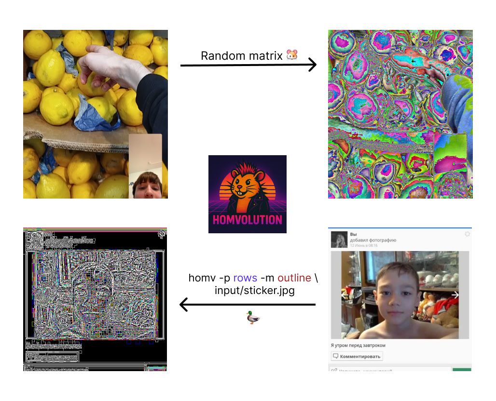
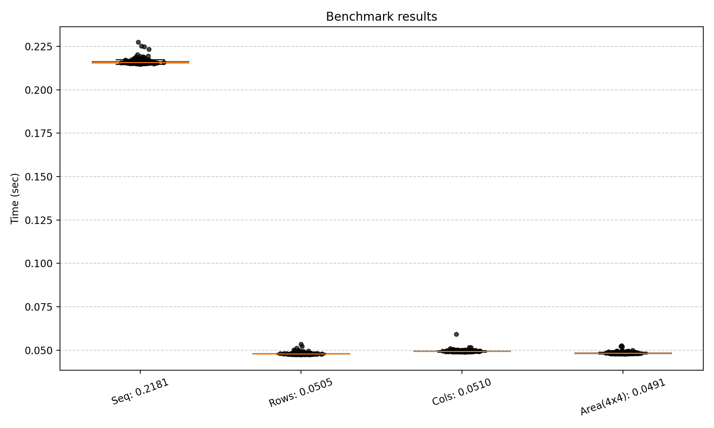
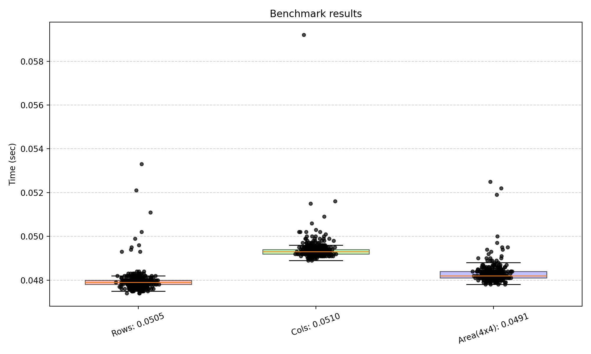
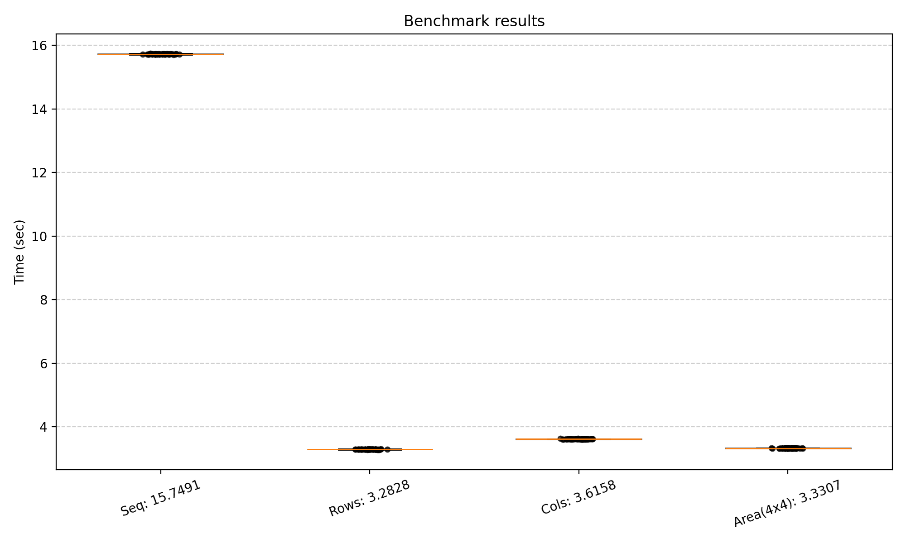
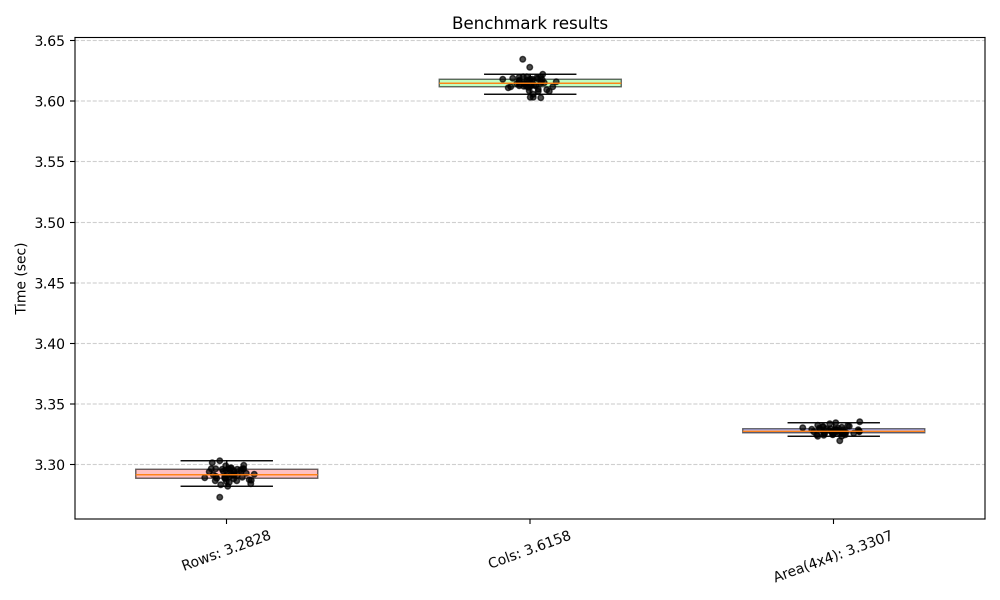

# Homvolution - convolution tool for image processing


## Overview

Homvolution is a CLI tool for applying convolution filters (matrices) to
images.



---

## Features

-   Multiple execution modes: `seq`, `rows`, `cols`, `pixels`,
    `area_W_H` (parallelization strategies).
-   Set of predefined kernels: `sharpen`, `blur`, `identity`,
    `bottom_sobel`, `outline`.
-   `random` kernel generation (currently fixed at 9×9).
-   Pipeline (queue / producer-consumer) mode with `-q`.
-   Reflect padding is applied automatically, so boundary checks are not
    needed.

---

## Dependencies

-   `stb_image.h`, `stb_image_write.h` (bundled in project).
-   OpenMP (`-fopenmp`) --- for parallel modes.
-   pthreads (`-pthread` or `-lpthread`) --- for queue mode.

---

## Usage

1. Build CLI

```
make build-cli
```

2. Run CLI with these paramatres:

```
Usage: ./build/app -p [seq | rows | cols | pixels | area_W_H] -m [blur | sharpen | identity | bottom_sobel | outline | random] [-q] ...files

-   `-p` --- parallelization strategy:
    -   `seq` --- sequential mode.
    -   `rows` --- parallel by rows.
    -   `cols` --- parallel by columns.
    -   `pixels` --- parallel by individual pixels.
    -   `area_W_H` --- splits image into blocks (width W, height H).
        Example: `area_64_64`.
-   `-m` --- convolution matrix:
    -   `sharpen`, `blur`, `identity`, `bottom_sobel`, `outline`,
        `random`.
    -   `random` generates a fixed **9×9** matrix in current
        implementation.
-   `-q` --- enable queue (pipeline) mode. Processing is done via
    reader/worker/writer threads.
```

3. Build benchmark tool

```bash
make build-bench
```

4. Run tests

```bash
make tests
```

### Examples

```bash
# sequential sharpen
./homv -p seq -m sharpen img1.jpg img2.png

# parallel blur by rows
./homv -p rows -m blur big.png

# outline filter with area 64x64
./homv -p area_64_64 -m outline photo.jpg

# pipeline + random kernel (9x9)
./homv -p rows -m random -q many_images/*.jpg
```

---

## Benchmark result

### Setup

-   AMD Ryzen™ 5 5600X 12-core 4.6 GHz
-   32gb RAM

### Results (1 Image, Small)




### Results (1 Image, Big)




## Input / Output

-   Input: any image format supported by `stb_image` (jpg, png, ...).
-   Output: saved to `output/output_<originalname>.jpg` (always JPEG,
    quality=100).
-   Channels: automatically detected (1, 3, or 4).

## Adding a New Kernel

1.  Define kernel values: `double matrix_new_values[] = { ... };`.
2.  Add to `homv_matrices[]` in `homv_matrix.c`.
3.  Extend parser in `main` to recognize new `-m` option.

---

## License

MIT License --- free to use, modify, and distribute.
